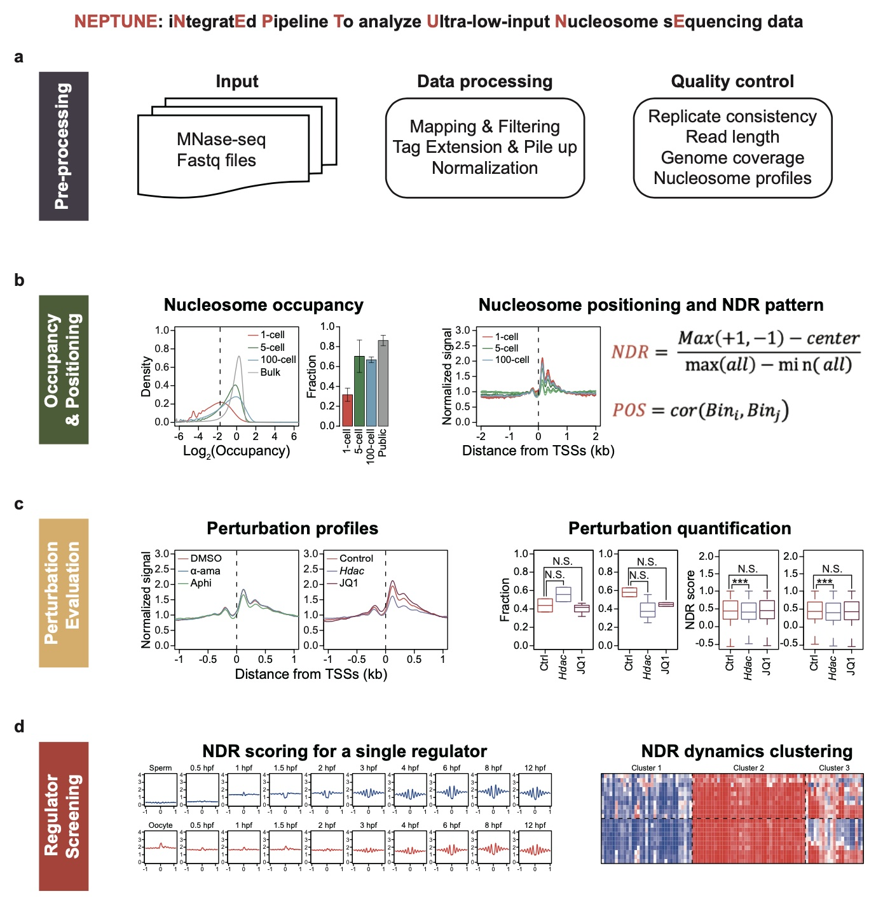

# NEPTUNE


**NEPTUNE**(i**N**tegrat**E**d **P**ipeline **T**o analyze **U**ltra-low-input **N**ucleosome s**E**quencing data) is a workflow for pre-processing and analyzing ultra-low-input Mnase-seq data. NEPTUNE consists four major functions, including preprocessing, nucleosome occupancy and positioning evaluation, nucleosome pertubation evaluation, and regulator screen based on nuclesome dataset.

<p align="center">

</p>

## Change Log

### v0.0.3
* Update README and parameter passing for NEPTUNE

### v0.0.2
* Update README of NEPTUNE

## System requirements
* Linux/Unix
* Python (>= 3.7)

## Installation
Use the following commands to install MEPTUNE:
``` bash
$ git clone https://github.com/chenfeiwang/NEPTUNE
```

## Citation

